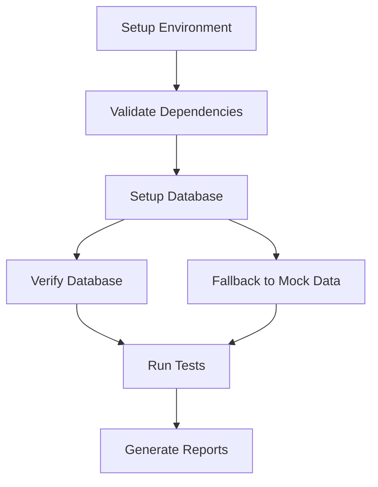

# 🗄️ Database Integration for CI/CD and Testing

This document describes the integration of the Staryer database setup script into the GitHub Actions workflows and testing pipeline.

## Overview

The database integration ensures that fresh Supabase environments are automatically set up with the complete Staryer schema and test data for all CI/CD runs and e2e testing scenarios.

## Key Components

### 1. Database Setup Script (`scripts/setup-database.js`)

A comprehensive script that handles database initialization across different environments:

**Features:**
- ✅ **Multi-method Setup** - Tries Supabase CLI, direct PostgreSQL, and JS client
- ✅ **Validation** - Validates SQL file and verifies setup completion
- ✅ **CI/CD Friendly** - Graceful fallbacks and verbose logging
- ✅ **Test Integration** - Integrates with existing test environment setup
- ✅ **Error Handling** - Continues with mock data when database unavailable

**Usage:**
```bash
# Local development
node scripts/setup-database.js --verbose

# CI/CD environment
node scripts/setup-database.js --ci --verbose
```

### 2. GitHub Actions Integration

#### Updated Workflows

**`test-and-build.yml`:**
- Added database setup step before e2e tests
- Includes environment variables for database access
- Validates database setup before running tests

**`comprehensive-test-platform.yml`:**
- Integrated database initialization in test environment setup
- Added proper error handling and logging
- Supports both database and mock data modes

#### Environment Variables

Required for database setup:
```yaml
env:
  NEXT_PUBLIC_SUPABASE_URL: ${{ secrets.NEXT_PUBLIC_SUPABASE_URL }}
  SUPABASE_SERVICE_ROLE_KEY: ${{ secrets.SUPABASE_SERVICE_ROLE_KEY }}
  DATABASE_URL: ${{ secrets.DATABASE_URL }}
  SUPABASE_DB_URL: ${{ secrets.SUPABASE_DB_URL }}
```

### 3. Database Setup Methods

The script attempts setup in order of preference:

#### Method 1: Supabase CLI (Local Development)
```bash
supabase db reset --linked
psql "$DATABASE_URL" < supabase/setup-staryer-database.sql
```

#### Method 2: Direct PostgreSQL (CI/CD Preferred)
```bash
psql "$DATABASE_URL" < supabase/setup-staryer-database.sql
```

#### Method 3: Supabase JS Client (Fallback)
- Executes SQL statements via Supabase client
- Used when direct database access is unavailable

## Database Schema

The setup script creates a complete Staryer database including:

- **16 Tables** - Complete schema with proper relationships
- **29 RLS Policies** - Multi-tenant security with Row-Level Security
- **30 Indexes** - Optimized for performance
- **17 Data Inserts** - Realistic test data for all user roles

### Core Tables

| Table | Purpose |
|-------|---------|
| `users` | User authentication and profiles |
| `tenants` | Multi-tenant organization |
| `creator_profiles` | Creator information and onboarding |
| `subscription_tiers` | Subscription management |
| `usage_events` | Usage tracking and metering |
| `audit_logs` | Compliance and audit trails |
| `creator_products` | Product management |
| `api_keys` | API access management |

## Verification and Validation

### Pre-Setup Validation
- Validates SQL file structure and content
- Checks for required tables, policies, and functions
- Verifies environment variable availability

### Post-Setup Verification
- Connects to database and verifies table creation
- Checks core table accessibility
- Validates multi-tenant functionality
- Logs setup statistics and health checks

### Troubleshooting

**Common Issues:**

1. **Missing Environment Variables**
   ```bash
   # Debug available variables
   node scripts/setup-database.js --verbose --ci
   ```

2. **Connection Failures**
   - Verify database URL format
   - Check service role key permissions
   - Ensure network connectivity

3. **RLS Policy Issues**
   - Check tenant context setup
   - Verify policy configuration
   - Review Supabase dashboard logs

## Pipeline Integration

### Test Flow with Database



### Pipeline Stages

1. **Environment Setup** - Install dependencies and prepare environment
2. **Database Initialization** - Execute database setup script
3. **Validation** - Verify database setup completion
4. **Test Execution** - Run e2e tests with live or mock data
5. **Reporting** - Generate test results and artifacts

## Benefits

### For Development
- ✅ **Consistent Environment** - Same database state across all environments
- ✅ **Realistic Testing** - Tests run against actual schema and data
- ✅ **Multi-tenant Testing** - Proper tenant isolation and security testing

### For CI/CD
- ✅ **Automated Setup** - No manual database preparation required
- ✅ **Reliable Testing** - Fresh database for each test run
- ✅ **Fallback Support** - Tests continue even if database unavailable

### For Testing
- ✅ **Complete Coverage** - All features tested with proper data
- ✅ **Security Testing** - RLS policies and tenant isolation verified
- ✅ **Performance Testing** - Indexes and optimizations validated

## Future Enhancements

Planned improvements for the database integration:

- **Schema Migrations** - Support for incremental schema updates
- **Data Seeding Options** - Different data sets for different test scenarios
- **Performance Monitoring** - Database setup timing and optimization
- **Parallel Testing** - Database isolation for concurrent test runs

## Configuration Examples

### Local Development Setup
```bash
# Copy environment template
cp env.local.txt .env.local

# Add your Supabase credentials
# Edit .env.local with actual values

# Setup database
node scripts/setup-database.js --verbose
```

### CI/CD Setup
```yaml
- name: Setup Database
  run: node scripts/setup-database.js --ci --verbose
  env:
    NEXT_PUBLIC_SUPABASE_URL: ${{ secrets.NEXT_PUBLIC_SUPABASE_URL }}
    SUPABASE_SERVICE_ROLE_KEY: ${{ secrets.SUPABASE_SERVICE_ROLE_KEY }}
```

## Support

For issues with database integration:

1. **Check Logs** - Review database setup output and error messages
2. **Validate Environment** - Ensure all required variables are set
3. **Test Manually** - Run setup script locally for debugging
4. **Review Documentation** - Check Supabase and PostgreSQL documentation

---

**Last Updated:** January 2025  
**Version:** 1.0.0  
**Compatibility:** Supabase PostgreSQL 15+, GitHub Actions