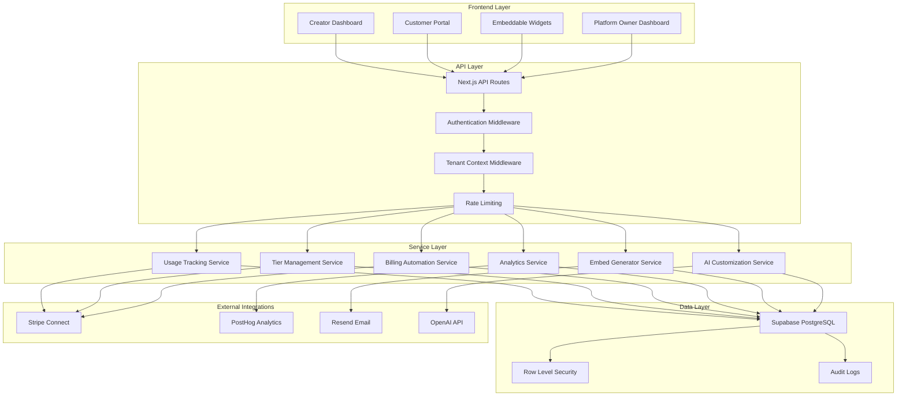
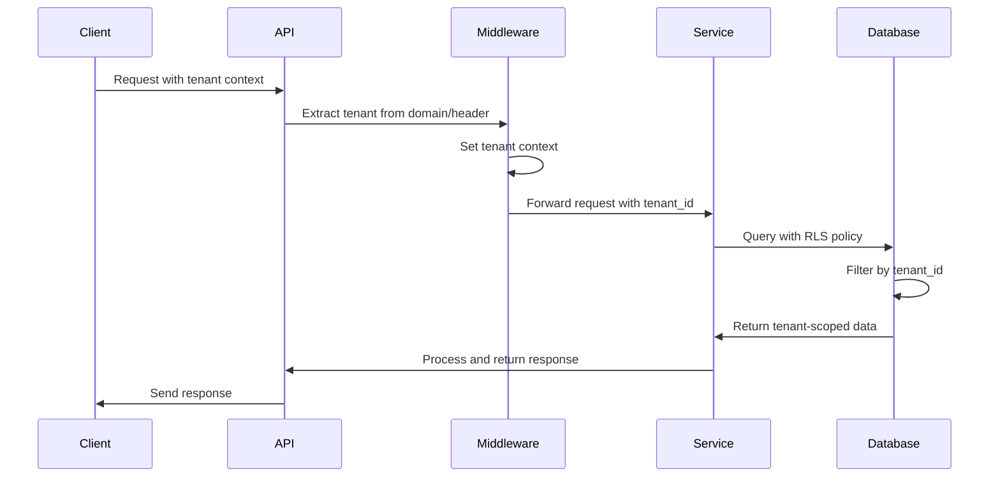
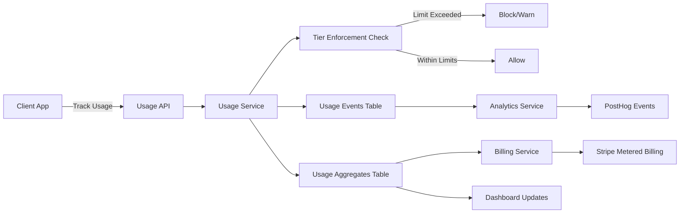
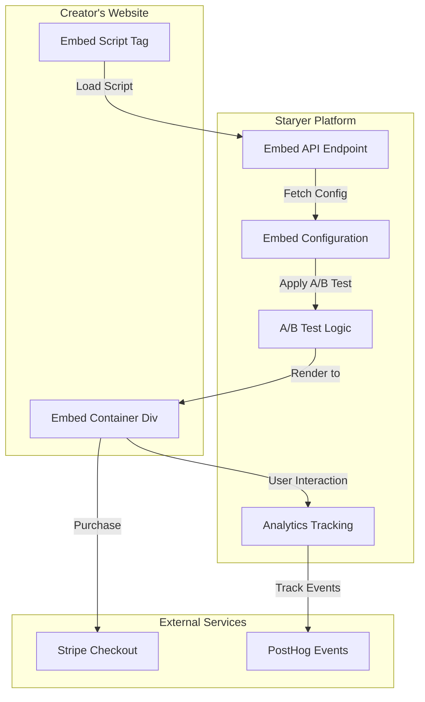
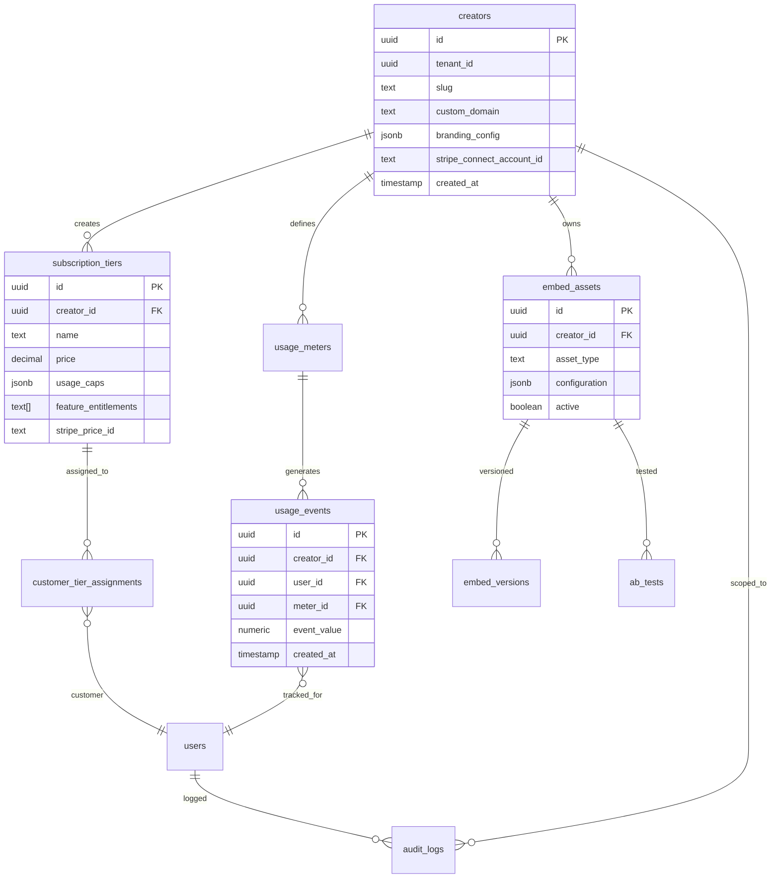
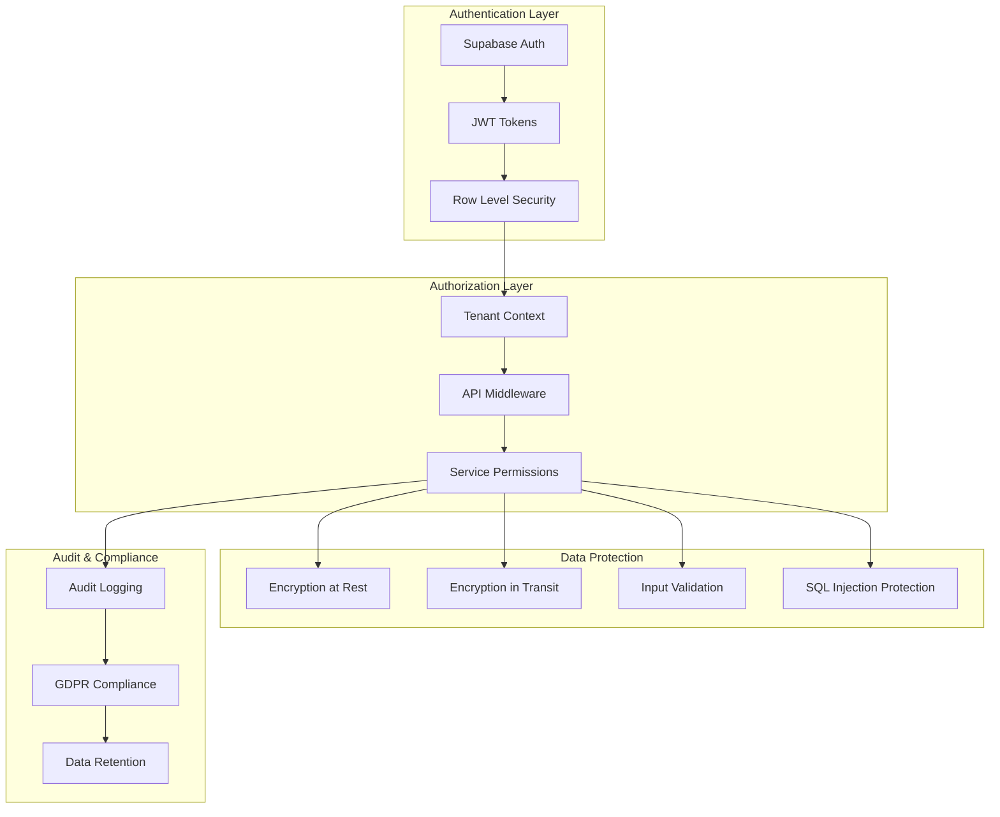
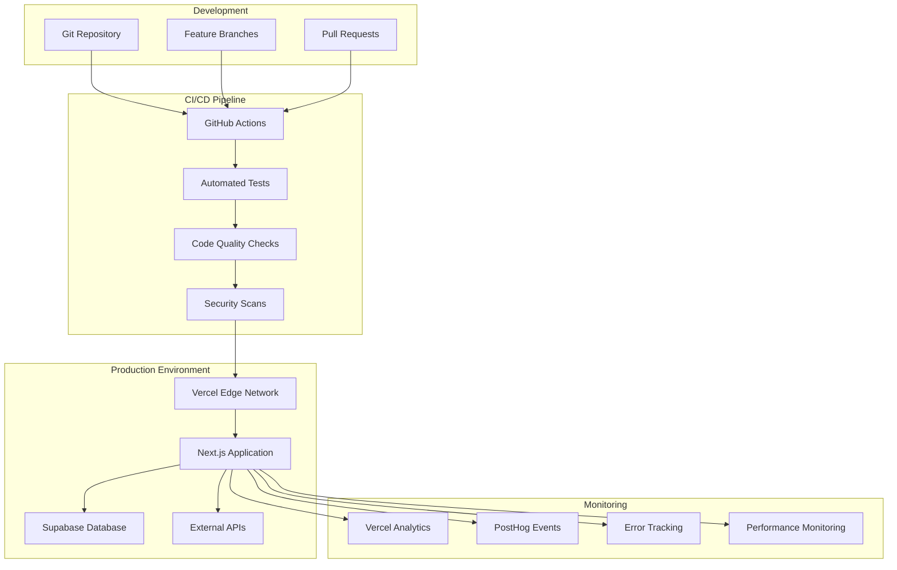
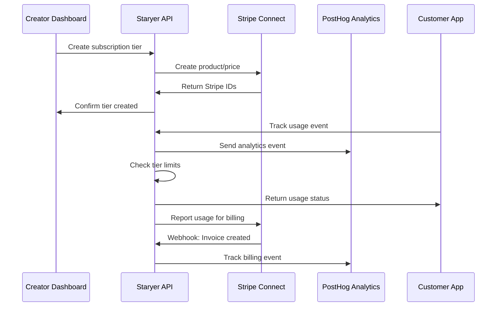

# Staryer Platform - Architecture Diagrams

## High-Level Architecture

## Multi-Tenant Data Flow

## Usage Tracking Flow

## Embed System Architecture

## Database Schema Overview

## Security Architecture

## Deployment Architecture

## Integration Flow

This architecture diagram collection provides a comprehensive visual overview of how all the components in the Staryer platform work together, from high-level architecture down to specific data flows and security patterns.