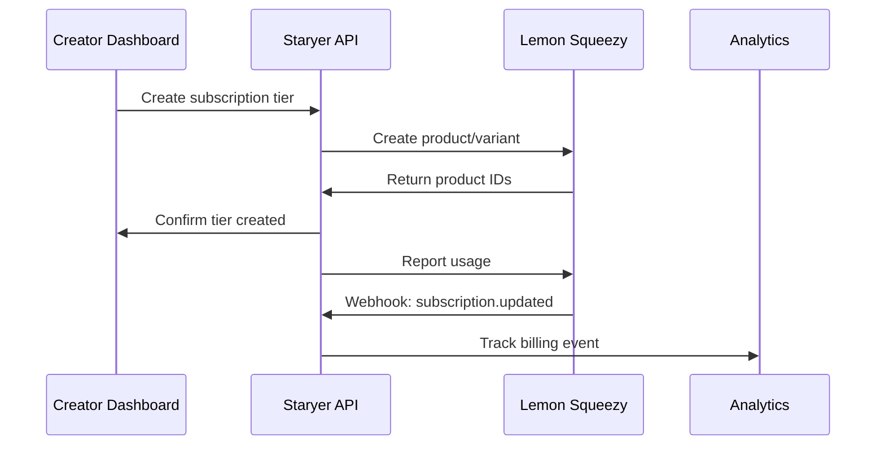

# Lemon Squeezy Integration Evaluation for Staryer Platform

## Executive Summary

This document evaluates Lemon Squeezy as a potential payment processor for integration with the Staryer platform. The assessment covers product features, integration feasibility, architecture alignment, customer value proposition, and implementation recommendations.

**Recommendation**: Lemon Squeezy presents a compelling integration opportunity with unique strengths in simplicity, developer experience, and specific market segments. Integration is recommended as a secondary payment processor to complement Stripe.

---

## 1. Product Evaluation

### 1.1 Lemon Squeezy Core Features

#### ✅ **Subscriptions & Recurring Billing**
- **Capabilities**: Full subscription lifecycle management
- **Comparison to Stripe**: Simplified setup, fewer configuration options
- **Staryer Compatibility**: Fully compatible with existing subscription tier system
- **Unique Advantages**: 
  - Built-in customer portal with zero configuration
  - Automatic tax calculation for digital products globally
  - Native support for usage-based billing

#### ✅ **Invoicing & Billing**
- **Capabilities**: Automated invoice generation, customizable templates
- **Comparison to Stripe**: More opinionated defaults, less customization
- **Staryer Compatibility**: Compatible with existing billing workflows
- **Unique Advantages**: 
  - Automatic VAT/GST handling for EU/global compliance
  - Built-in affiliate program management

#### ✅ **Usage-Based Billing**
- **Capabilities**: Metered billing, usage reporting, flexible pricing models
- **Comparison to Stripe**: Similar capabilities, simpler API
- **Staryer Compatibility**: Direct compatibility with existing usage tracking
- **Integration Points**: 
  - `BillingService` can be extended for Lemon Squeezy
  - Usage meters align with Staryer's `usage_meters` table structure

#### ✅ **Multi-Currency Support**
- **Capabilities**: 135+ currencies, automatic currency conversion
- **Comparison to Stripe**: Broader currency support
- **Staryer Compatibility**: Enhances existing multi-currency capabilities
- **Unique Advantages**: 
  - Purchasing Power Parity (PPP) pricing
  - Regional price optimization

### 1.2 Feature Comparison Matrix

| Feature | Stripe | Lemon Squeezy | Advantage |
|---------|--------|---------------|-----------|
| Subscription Management | ⭐⭐⭐⭐⭐ | ⭐⭐⭐⭐ | Stripe (flexibility) |
| Tax Compliance | ⭐⭐⭐ | ⭐⭐⭐⭐⭐ | Lemon Squeezy |
| Developer Experience | ⭐⭐⭐⭐ | ⭐⭐⭐⭐⭐ | Lemon Squeezy |
| Global Coverage | ⭐⭐⭐⭐⭐ | ⭐⭐⭐⭐ | Stripe |
| Webhook Reliability | ⭐⭐⭐⭐⭐ | ⭐⭐⭐⭐ | Stripe |
| API Documentation | ⭐⭐⭐⭐ | ⭐⭐⭐⭐⭐ | Lemon Squeezy |
| Customer Portal | ⭐⭐⭐ | ⭐⭐⭐⭐⭐ | Lemon Squeezy |
| Affiliate Management | ❌ | ⭐⭐⭐⭐⭐ | Lemon Squeezy |

---

## 2. Integration Feasibility

### 2.1 API Architecture Assessment

#### **OAuth & Authentication**
```typescript
// Lemon Squeezy API Authentication Pattern
interface LemonSqueezyAuth {
  apiKey: string; // Simple API key authentication
  testMode: boolean; // Sandbox vs Production
}

// Comparison to existing pattern in Staryer
// Current: OAuth2 flows for Stripe, PayPal, Square
// Lemon Squeezy: Simpler API key authentication (easier integration)
```

#### **Webhook System**
- **Event Types**: Similar to Stripe (subscription.created, payment.succeeded, etc.)
- **Reliability**: Automatic retry with exponential backoff
- **Security**: HMAC signature verification (same pattern as Stripe)
- **Integration**: Can reuse existing webhook infrastructure in `src/app/api/webhooks/`

#### **API Rate Limits**
- **Limits**: 5000 requests/minute (more generous than most providers)
- **Comparison**: Higher than Square (500/min), lower than PayPal (1000/hour)
- **Staryer Impact**: Suitable for platform-scale operations

### 2.2 Integration Complexity Assessment

#### **Low Complexity Areas** ✅
- API key authentication (simpler than OAuth)
- Webhook event handling (similar patterns to Stripe)
- Product/subscription creation
- Customer management

#### **Medium Complexity Areas** ⚠️
- Usage-based billing integration with existing meters
- role-based account management
- Currency conversion handling

#### **High Complexity Areas** ❌
- Limited customization compared to Stripe
- Fewer payment methods than Stripe
- Different settlement patterns

### 2.3 Required Code Changes

```typescript
// Addition to IntegrationService
{
  id: 'lemon-squeezy',
  name: 'Lemon Squeezy',
  category: 'payment',
  description: 'Developer-first payment processing with built-in tax compliance',
  capabilities: ['payments', 'subscriptions', 'usage-billing', 'tax-compliance', 'affiliates'],
  requiresAuth: true,
  authType: 'api-key',
  configurationFields: [
    { key: 'api_key', type: 'password', label: 'API Key', required: true },
    { key: 'store_id', type: 'text', label: 'Store ID', required: true },
    { key: 'test_mode', type: 'checkbox', label: 'Test Mode', required: false }
  ],
  webhookEvents: [
    'order.created', 'subscription.created', 'subscription.updated', 
    'subscription.cancelled', 'license.key.created'
  ],
  rateLimits: { requests: 5000, period: 'minute' },
  documentation: {
    setupGuide: '/docs/integrations/lemon-squeezy',
    apiDocs: 'https://docs.lemonsqueezy.com/api',
    examples: ['subscription-setup', 'usage-billing', 'webhook-handling']
  }
}
```

---

## 3. Architecture Alignment

### 3.1 Event-Driven Architecture Compatibility

#### **Webhook Integration** ✅
- Lemon Squeezy webhooks align perfectly with Staryer's event-driven architecture
- Can extend existing webhook handler in `src/app/api/webhooks/route.ts`
- Events map cleanly to PostHog analytics pipeline

#### **Database Schema Compatibility** ✅
```sql
-- Existing creator_profiles table can accommodate Lemon Squeezy
ALTER TABLE creator_profiles ADD COLUMN lemon_squeezy_store_id TEXT;
ALTER TABLE creator_profiles ADD COLUMN lemon_squeezy_api_key TEXT;
ALTER TABLE creator_profiles ADD COLUMN lemon_squeezy_enabled BOOLEAN DEFAULT FALSE;
```

#### **Service Layer Integration** ✅
- Fits existing `IntegrationService` pattern
- Can extend `BillingService` for usage-based billing
- Complements existing Stripe integration without conflicts

### 3.2 role-based Architecture

#### **Account Isolation** ✅
- Lemon Squeezy stores provide natural tenant isolation
- Each creator can have independent Lemon Squeezy store
- Aligns with existing Stripe Connect account pattern

#### **Data Flow** ✅


---

## 4. Customer Value Proposition

### 4.1 Unique Value for Staryer Customers

#### **Tax Compliance Automation** 🎯
- **Pain Point**: Many SaaS creators struggle with global tax compliance
- **Lemon Squeezy Solution**: Automatic VAT/GST calculation and remittance
- **Customer Value**: Removes 20+ hours/month of tax administration
- **Target Segments**: International SaaS creators, digital product sellers

#### **Simplified Setup Experience** 🎯
- **Pain Point**: Stripe setup can be complex for non-technical creators
- **Lemon Squeezy Solution**: One-click store setup, built-in customer portal
- **Customer Value**: Reduces setup time from days to hours
- **Target Segments**: Solo entrepreneurs, non-technical creators

#### **Built-in Affiliate Management** 🎯
- **Pain Point**: Creators need separate tools for affiliate programs
- **Lemon Squeezy Solution**: Native affiliate program with tracking
- **Customer Value**: Additional revenue stream without extra tools
- **Target Segments**: Course creators, digital product sellers

#### **Purchasing Power Parity** 🎯
- **Pain Point**: Fixed pricing excludes customers from developing markets
- **Lemon Squeezy Solution**: Automatic regional pricing adjustments
- **Customer Value**: Increased conversion in global markets
- **Target Segments**: Global SaaS products, educational content

### 4.2 Customer Segments Alignment

| Segment | Stripe Preference | Lemon Squeezy Preference | Reason |
|---------|-------------------|-------------------------|---------|
| Enterprise SaaS | ✅ Primary | ❌ Not suitable | Complex integrations, enterprise features |
| Solo Entrepreneurs | ⚠️ Complex | ✅ Ideal | Simplicity, tax compliance |
| Digital Products | ⚠️ Overkill | ✅ Perfect | Built for digital sales |
| Global SaaS | ✅ Established | ✅ Compelling | PPP pricing, tax compliance |
| Course Creators | ⚠️ Technical | ✅ Natural fit | Affiliates, customer portal |

---

## 5. Gap Analysis and Recommendations

### 5.1 Feature Gaps

#### **Critical Gaps** ❌
- **Payment Methods**: Limited compared to Stripe (no wallets, BNPL)
- **Enterprise Features**: No advanced fraud protection
- **Customization**: Less flexible than Stripe for complex use cases

#### **Minor Gaps** ⚠️
- **Reporting**: Less detailed than Stripe's analytics
- **Multi-party Payments**: No marketplace features like Stripe Connect
- **Regional Availability**: Fewer supported countries for sellers

### 5.2 Integration Recommendations

#### **Phase 1: Core Integration** (2-3 weeks)
1. Add Lemon Squeezy to `IntegrationService`
2. Extend webhook handler for Lemon Squeezy events
3. Create Lemon Squeezy OAuth callback flow
4. Basic subscription and payment processing

#### **Phase 2: Advanced Features** (2-4 weeks)
1. Usage-based billing integration
2. Customer portal embedding
3. Affiliate program integration
4. Advanced webhook event handling

#### **Phase 3: Optimization** (1-2 weeks)
1. Performance optimization
2. Error handling and retry logic
3. Comprehensive testing
4. Documentation and examples

### 5.3 Implementation Strategy

#### **Positioning Strategy**
- **Primary Use Case**: Complement Stripe for specific customer segments
- **Target Customers**: 
  - Solo entrepreneurs seeking simplicity
  - Digital product creators
  - Global SaaS needing tax compliance
  - Creators wanting built-in affiliate programs

#### **Migration Path**
- Offer as alternative during onboarding
- Allow switching between processors
- Maintain dual integration for flexibility

---

## 6. Technical Implementation Plan

### 6.1 Code Structure

```typescript
// New service structure
src/features/integrations/services/
├── integration-service.ts (extend existing)
├── lemon-squeezy/
│   ├── lemon-squeezy-client.ts
│   ├── lemon-squeezy-webhooks.ts
│   ├── lemon-squeezy-billing.ts
│   └── types.ts

// Webhook integration
src/app/api/webhooks/lemon-squeezy/route.ts

// OAuth callback
src/app/api/lemon-squeezy-callback/route.ts
```

### 6.2 Database Changes

```sql
-- Minimal schema additions
ALTER TABLE creator_profiles ADD COLUMN lemon_squeezy_store_id TEXT;
ALTER TABLE creator_profiles ADD COLUMN lemon_squeezy_api_key TEXT; -- encrypted
ALTER TABLE creator_profiles ADD COLUMN lemon_squeezy_enabled BOOLEAN DEFAULT FALSE;

-- Integration tracking
CREATE TABLE integration_sync_logs (
  id UUID PRIMARY KEY DEFAULT gen_random_uuid(),
  creator_id UUID REFERENCES creator_profiles(id),
  provider_id TEXT NOT NULL,
  sync_type TEXT NOT NULL,
  status TEXT NOT NULL,
  created_at TIMESTAMP DEFAULT NOW()
);
```

### 6.3 Environment Variables

```bash
# Lemon Squeezy Configuration
LEMON_SQUEEZY_API_KEY=your_api_key
LEMON_SQUEEZY_WEBHOOK_SECRET=your_webhook_secret
LEMON_SQUEEZY_STORE_ID=your_store_id
```

---

## 7. Competitive Analysis

### 7.1 Market Position

| Aspect | Stripe | Lemon Squeezy | Market Impact |
|--------|--------|---------------|---------------|
| Market Share | 📈 Dominant | 📊 Growing | Complementary positioning |
| Developer Focus | ⭐⭐⭐⭐ | ⭐⭐⭐⭐⭐ | Strong differentiation |
| Enterprise | ✅ Leader | ❌ Limited | Clear market segmentation |
| SMB/Solo | ⚠️ Complex | ✅ Optimized | Opportunity for Staryer |

### 7.2 Strategic Value

#### **Diversification Benefits**
- Reduces dependency on single payment processor
- Appeals to different customer segments
- Provides negotiation leverage with vendors

#### **Competitive Advantages**
- First-mover advantage in Lemon Squeezy integration
- Unique value proposition for specific segments
- Enhanced customer retention through choice

---

## 8. Risk Assessment

### 8.1 Technical Risks

| Risk | Probability | Impact | Mitigation |
|------|-------------|--------|------------|
| API Changes | Medium | Medium | Version pinning, monitoring |
| Webhook Reliability | Low | High | Retry logic, monitoring |
| Rate Limits | Low | Medium | Caching, batching |
| Data Migration | Medium | High | Careful testing, rollback plan |

### 8.2 Business Risks

| Risk | Probability | Impact | Mitigation |
|------|-------------|--------|------------|
| Limited Adoption | Medium | Low | Targeted marketing, clear positioning |
| Maintenance Overhead | High | Medium | Automated testing, monitoring |
| Feature Parity | Medium | Medium | Clear communication of differences |

---

## 9. Success Metrics

### 9.1 Technical KPIs
- Integration completion rate: >95%
- Webhook success rate: >99.5%
- API response time: <200ms p95
- Error rate: <0.1%

### 9.2 Business KPIs
- Adoption rate among new creators: >15%
- Customer satisfaction: >4.5/5
- Support ticket reduction: >20%
- Revenue per customer: +10% (due to better conversion)

---

## 10. Conclusion and Next Steps

### 10.1 Final Recommendation

**PROCEED** with Lemon Squeezy integration as a **complementary payment processor** to Stripe. The integration offers:

1. **Clear Value Proposition**: Serves underserved customer segments
2. **Technical Feasibility**: Fits existing architecture patterns
3. **Low Risk**: Limited downside with significant upside potential
4. **Strategic Value**: Enhances Staryer's competitive position

### 10.2 Immediate Next Steps

1. **Stakeholder Approval**: Present findings to product and engineering teams
2. **Resource Allocation**: Assign 1-2 developers for 6-8 week implementation
3. **Design Review**: Create detailed technical specification
4. **Pilot Program**: Identify 10-20 beta customers for early access
5. **Go-to-Market**: Develop positioning and marketing materials

### 10.3 Success Criteria

- **Technical**: Successful integration following Staryer patterns
- **Business**: >10% of new creators choose Lemon Squeezy
- **Customer**: Positive feedback from target segments
- **Strategic**: Enhanced competitive positioning in SMB market

---

*This evaluation was conducted based on current Staryer architecture and Lemon Squeezy capabilities as of 2024. Regular review and updates are recommended as both platforms evolve.*